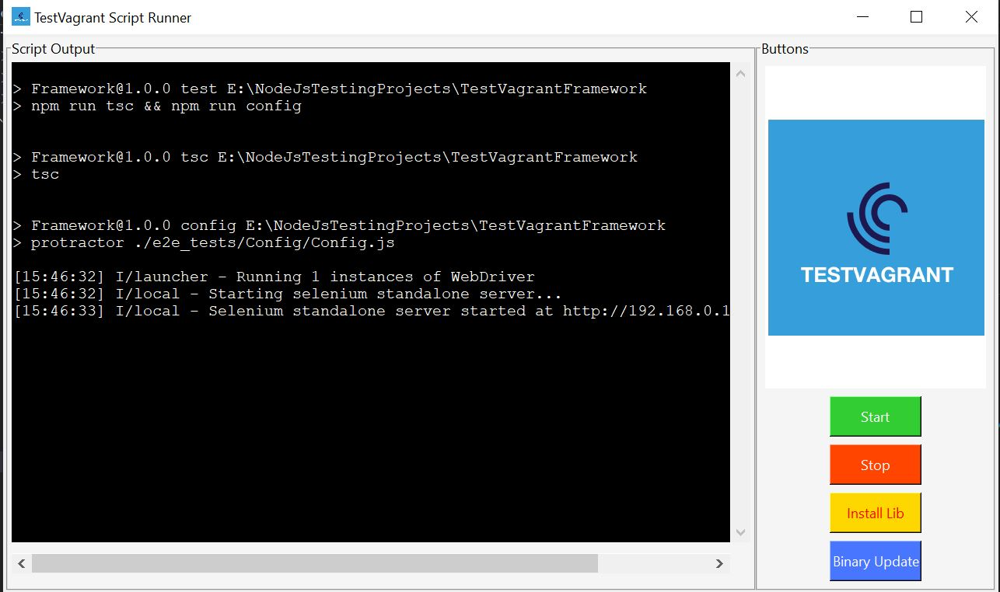

# Pre-requisite to Start Execution:
1. *Java (JDK)*
2. *Nodejs*
3. *Any IDE Such as visual studio code*

# Commands to Execute the TestCases:
1. *npm install*

	To install all dependencies

2. *npm run webdrivermanager:update*

	To update or install all executable binaries

3. *npm run test*

	To Start the Execution

# Reports will Gererated in:
1. *allure-results*

	Allure reports will generated"

2. *TestReports Folder*

	Junit , Pdf and Html Reports

# TestExecution can also started by executing :
# TestExecution started by Running Script_Running.exe:

1. Run Script_Runner.exe
2. Click on Install Library Button
3. Click on Webdriver Update Button
4. Click on Start Button

